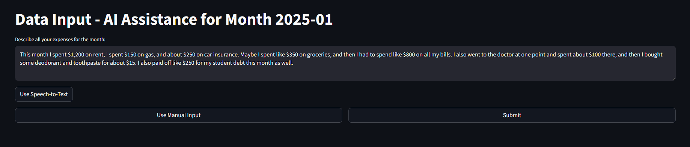
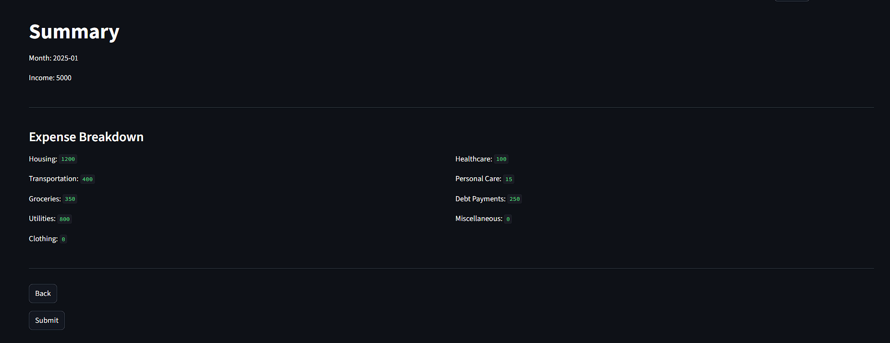

# Personal Finance Dashboard  
### Streamlit • SQLite • AI • Speech-to-Text

A full-stack personal finance tracking application built with **Streamlit** and **SQLite**, designed to help users log income and expenses, visualize monthly trends, and interact with their data using **AI-assisted natural language input and speech-to-text**.

This project was developed as part of **CPSC-350**.

## Overview

The goal of this project was to build an end-to-end data-driven application that balances **data integrity**, and **user-friendly interaction**. The system supports structured financial data storage while easing the user experience through AI-powered input methods.

## Running the Application

### Prerequisites
- Python 3.10 or newer
- pip (Python package manager)

### Clone the Repository

```bash
git clone https://github.com/A-Maherr/CPSC350Project.git
cd CPSC350Project
```
### Install Dependencies
```bash
pip install -r requirements.txt
```
### Run the Application
```bash
streamlit run Main.py
```
## API Key Configuration

This application uses AI-powered parsing to convert free-form or spoken expense input into structured data.  
To enable these features, an **API key is required**.

### Streamlit Secrets

The project uses Streamlit’s built-in secrets management.

Add your API key to the existing file:

```text
.streamlit/secrets.toml
```
## Screenshots

### Dashboard Overview


### Category Monthly Breakdown


### AI-Assisted Expenses Input


### Summary Overview


---

## Database Schema

```text
Users
 └── id (PK)
 └── username

Income
 └── user_id (FK)
 └── monthly_income
 └── date (YYYY-MM)

Expense_type
 └── id (PK)
 └── category_name

Expenses
 └── user_id (FK)
 └── expense_type_id (FK)
 └── amount
 └── date (YYYY-MM)
```
